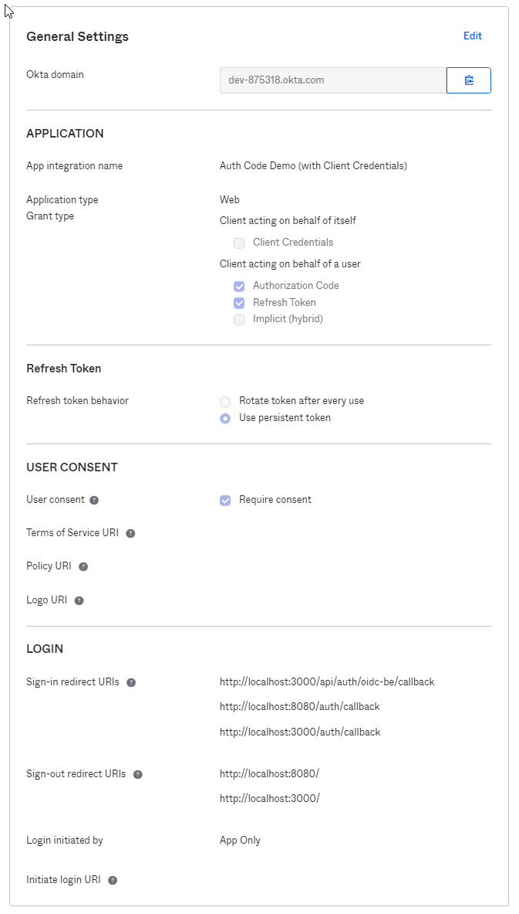

# Oidc/Oauth 2.0 Auth code flow
- the playground showcases a side by side comeparison of a backend driven auth code flow (standarad) and an improvised version of front end driven auth code flow
- Do refer to [medium page](https://ysyau.medium.com/spa-and-rest-api-application-friendly-oauth-2-0-oidc-login-flow-80ba927ff47d) for detailed write up

## Playground Setup
- Start mongodb docker `docker-compose up`
- Although application setup is seperated to frontend(fe) and backend(be), both of them are hosted under the backend server.
- `app-fe` is based on vue.js, `npm i` and `npm run build` to build the UI assets.
- and finally navigate to `app-be`, `npm i` and `npm run start` to start the application
- navigate to `http://localhost:3000`, you should see two buttons available for login
- `Oidc Auth Code BE Login` represents the standard Auth Code login
- `Oidc Auth Code FE Login` represents the improvised version of Front End Driven Auth Code login
- While navigate to IdP (OKTA), do proceed login using `sample@example.com` | `Password123`

## IdP Setup (OKTA)
Web Type based OIDC Application

